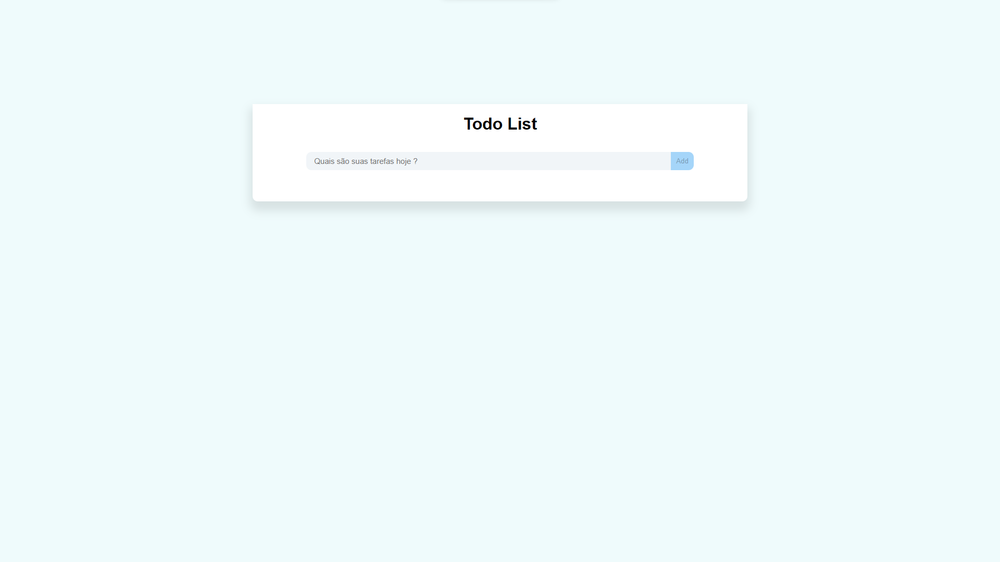

<h1 align="center"> Todo List</h1>

Dedicated project to write down what to do

  <a href="#-tecnologias">Technologies</a>&nbsp;&nbsp;&nbsp;|&nbsp;&nbsp;&nbsp;
  <a href="#-projeto">Project</a>&nbsp;&nbsp;&nbsp;|&nbsp;&nbsp;&nbsp;
  <a href="#-links">Live Site</a>&nbsp;&nbsp;&nbsp;|&nbsp;&nbsp;&nbsp;

    

 

## 📚 Users can be:

- Add Task
- Remove Task

  
## 🚀 Technologies

This project was developed with the following technologies:

- HTML Semantic
- CSS
- JavaScript 
- Flexbox
- Manipulation of DOM
- Creation elements whit JavaScript

## 💻 Project

In this project I was able to delve even further into the manipulation of the Dom and with that I am expanding my knowledge.

## 📲 Links

- Live Site URL: https://teal-phoenix-166164.netlify.app/
